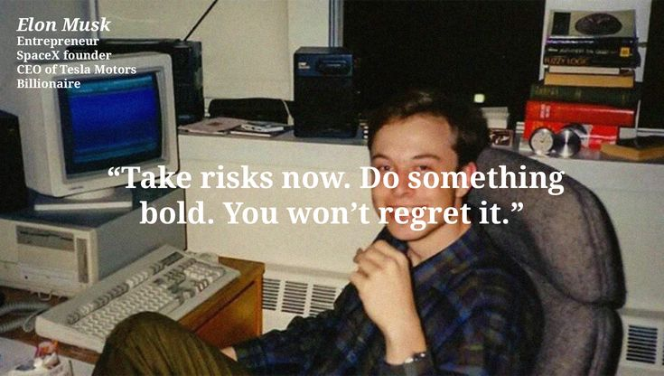

# UFC, the USAR FOSS Club

Build. Break. Collaborate. Repeat.



This is the code for the website of UFC, the open source club at the University School of Automation and Robotics (USAR), GGSIPU. It is a student run club, backed by [FOSS United](https://fossunited.org/c/university-school-of-automation-and-robotics), and this website is one of the things we build together. If you found a typo, a bug or something that could be nicer, you are exactly who this repo is for.

## Why the club exists

In 2025 Siddharth and a few friends noticed that plenty of people at USAR could code, but most of it stayed on their own laptops. Nobody on campus was making open source the main thing. So they started a club for it, and other people turned up.

We keep the philosophy short on purpose. There are four things we care about, and the rest of what we do comes from them.

1. **Everyone is invited.** Developers, designers, hardware tinkerers, writers, organisers and total beginners. Open source gets better with every kind of person in it, so we make room on purpose.
2. **No proprietary master.** No company, sponsor or single person owns the club. We pick our own projects, make our own rules and share what we make.
3. **No hierarchy that matters.** Somebody has to run the group chat and book the rooms, but titles do not decide whose idea wins. A first-year's pull request gets the same review as anyone else's.
4. **Spread the word.** Most students have never heard of open source, or assume it is not for them. We run workshops, talks and events, and have a lot of conversations, so more people know it is for them too.

If something helps the project or the people around it, we count it as a contribution. That includes code, but it also includes a poster, a doc fix, a good question, a soldered board or a well run event.

## How the website explains us

The site is not a brochure with a list of features. It tries to explain the club the way we would explain it to a friend, and it follows a few rules.

**Plain, human words.** We write in the first person plural and keep the tone friendly. No corporate phrases, no hype, no long manifesto. If a sentence sounds like a press release, we rewrite it. We also avoid em dashes and emojis in the copy, because they make it read like it was written by a machine.

**One idea per section.** The home page is a single scroll, and each chapter has one job.

| Chapter        | What it says                                                                                                                                                                                                                                                                                                                                                                  |
| -------------- | ----------------------------------------------------------------------------------------------------------------------------------------------------------------------------------------------------------------------------------------------------------------------------------------------------------------------------------------------------------------------------- |
| Premise        | The four freedoms of free software (run, study, share, improve), numbered 0 to 3 like a programmer would, each one paired with something the club actually does about it.                                                                                                                                                                                                     |
| The bazaar     | Eric Raymond's cathedral and bazaar: closed software is built by a few people behind doors, open software by everyone who turns up. And the people who turned up first were never one type of person.                                                                                                                                                                         |
| The big tent   | Open source needs designers, writers, hardware people and beginners, not only programmers. Pick what sounds like you.                                                                                                                                                                                                                                                         |
| The log        | A clothesline of the things we have run so far, from Genesis to Build with TRAE, so the history is easy to see.                                                                                                                                                                                                                                                               |
| The core leads | The students who keep the community alive, shown as a wall of photos with a short note each.                                                                                                                                                                                                                                                                                  |
| The workshop   | The projects the community is proudest of, each one an exploded drawing. The layers of the project float apart in 3D with a label on each, and scrolling pushes them back together. Then a stamp lands on it. Every project has its own coloured paper, and the next one is pulled up over the last like a torn sheet. A blank last scene invites you to bring the next idea. |
| The zoo        | The mascots and logos of the open source world, as stickers you can grab and throw around.                                                                                                                                                                                                                                                                                    |
| The invitation | Where to join us.                                                                                                                                                                                                                                                                                                                                                             |

**Show, do not only tell.** The design is a scrapbook on purpose. Tape, polaroids, sticky notes and stickers say that this is a club made by people, not a company. Several pieces are interactive, such as the stickers you can drag and the thread that follows you down the About page. They are there to be fun, and the text still works without them.

**Be honest about the size.** We are one year old. The About page tells the story as it happened, including the parts where we were just a few friends with a group chat. The Achievements page says plainly where members have ended up, such as GSoC, FOSS United, DRDO and OWASP.

**Everyone can find a way in.** Pages end with something a newcomer can do next, whether that is joining the chat, reading about an event or opening a pull request.

### Where the copy lives

All the words on the public pages are plain data, so you can fix wording without touching any layout.

| What                                                | File                                                                     |
| --------------------------------------------------- | ------------------------------------------------------------------------ |
| Home page links, freedoms, log entries, team, roles | [src/components/home/data.ts](src/components/home/data.ts)               |
| About page story and beliefs                        | [src/components/about/story-data.ts](src/components/about/story-data.ts) |
| Events and the per-event pages                      | [src/data/events.ts](src/data/events.ts)                                 |
| Achievements                                        | [src/data/achievements.ts](src/data/achievements.ts)                     |
| The workshop (the featured projects)                | [src/data/flagship.ts](src/data/flagship.ts)                             |
| The whole first bootcamp, for the archive           | [src/data/projects.ts](src/data/projects.ts)                             |

The events file is the single source of truth for event dates and details. Every events page reads from it, so fix a detail there and it is fixed everywhere.

## Search and link previews

The address, the site description and the picture shown when a link is shared all live in [src/data/site.ts](src/data/site.ts), so a change of domain happens in one place. Every page sets its own canonical address and preview through `pageMetadata()`, and each event page also describes itself to search engines as an event. If you add a public page, give it `pageMetadata()` and add it to [src/app/sitemap.ts](src/app/sitemap.ts). Pages that are not for search, such as sign in and the dashboard, are kept out of the sitemap and marked `noindex`.

## What is in the site

- **Home, About, Events, Achievements.** Public pages. Each event also has its own page at `/events/<slug>`.
- **Login.** Sign in with GitHub.
- **Dashboard.** For signed in members: an overview with a GitHub contribution map, a leaderboard, an activity feed, the member list, event proposals, and settings. Staff also get a review queue for events that members propose.

## Tech

- Next.js 16 (App Router) with React 19 and TypeScript
- Tailwind CSS 4, plus a hand written design system in `src/components/home/home.css`
- Framer Motion for animation, Lenis for smooth scrolling, Matter.js for the sticker physics, d3 for the LeetCode heatmap
- next-auth with GitHub OAuth
- Prisma 7 with PostgreSQL
- Upstash Redis for caching and live updates, and Upstash QStash for the background GitHub sync

## Running it locally

You need Node.js and a PostgreSQL database. A free Neon or Supabase database works fine.

```bash
git clone https://github.com/USAR-FOSS/ufc_website.git
cd ufc_website
npm install
cp .env.example .env
```

Fill in `.env`. The file has a comment next to every value that explains where to get it. The only things you must create yourself are a database, a [GitHub OAuth app](https://github.com/settings/developers) with the callback `http://localhost:3000/api/auth/callback/github`, and a random secret. Then:

```bash
npx prisma migrate deploy
npm run dev
```

Open [http://localhost:3000](http://localhost:3000). The public pages work without any of the Upstash keys. They are only needed for the dashboard's caching and background sync.

### Background sync with QStash (optional)

When someone signs in, the site queues a job that pulls their GitHub activity in the background, so the dashboard and leaderboard stay fresh without slowing down login. That queue is [Upstash QStash](https://upstash.com/docs/qstash). Without it, sign in still works and the app just logs that it skipped the sync, so you can ignore this section until you want to work on the dashboard.

To try it locally, run a QStash dev server in a second terminal:

```bash
npx @upstash/qstash-cli dev
```

It prints a set of credentials. Copy them into your `.env`:

```bash
QSTASH_URL=http://127.0.0.1:8080
QSTASH_TOKEN=...
QSTASH_CURRENT_SIGNING_KEY=...
QSTASH_NEXT_SIGNING_KEY=...
```

Also set `NEXTAUTH_URL=http://localhost:3000`, so QStash knows where to send the job. Restart `npm run dev`, sign in, and the sync job arrives at `/api/jobs/github-sync`. The signing keys are how that route checks that a request really came from QStash, and without them it answers 503.

The first run downloads the right binary for your system. If npm blocks the package's install script, get the CLI from the [QStash local development docs](https://upstash.com/docs/qstash/howto/local-development) and run its `dev` command instead. Do not commit the binary, it is gitignored.

### What runs in the background

Both GitHub and LeetCode work the same way. When a member signs in, or links LeetCode in Settings, their numbers are stored straight away, and after that QStash jobs keep them fresh. Each job is a signed request to a route in `src/app/api/jobs`:

| Route                          | What it does                                                     | Schedule to create in QStash |
| ------------------------------ | ---------------------------------------------------------------- | ---------------------------- |
| `/api/jobs/github-reconcile`   | Queues a GitHub sync for every member active in the last 30 days | every 6 hours                |
| `/api/jobs/leetcode-reconcile` | Queues a LeetCode sync for every active member who linked one    | every 6 hours                |
| `/api/jobs/activity-cleanup`   | Removes activity feed entries older than 36 hours                | hourly                       |

The `reconcile` routes then queue one `github-sync` or `leetcode-sync` job per member, so a slow account never holds up the others. The schedules are created once in the QStash dashboard, pointing at your deployed address.

### How an event gets approved

Any signed in member can propose an event, and an admin decides. The rules live in one place, [src/server/features/events/events.service.ts](src/server/features/events/events.service.ts), and the API routes only call it.

1. **Propose.** The form asks for what an event page shows: title and subtitle, kind, when and where, a summary, the overview, highlights, who it is for, what to bring, a schedule (one or several days), the rounds of a competition, a speaker, registration and poster links, and tags. Only the basics and a paragraph of overview are required. Everything is validated (lengths, whole-number seats, web addresses only), and and nobody can propose more than 5 events in any rolling 24 hours. Withdrawn and rejected proposals still count, so the limit cannot be dodged. It holds even if several requests arrive at once. An admin's own proposal is published straight away.
2. **Review queue.** Admins see waiting proposals oldest first on the Admin page.
3. **Decide.** An admin approves or rejects. A rejection needs a reason, which the proposer can read. A proposal is decided exactly once: if two admins click at the same moment, one wins and the other is told it was already decided.
4. **Published.** Only approved events are public and open for registration. Registration checks capacity under a lock, so the last seat cannot be given out twice.
5. **Withdraw.** The proposer can take back a proposal that is still waiting.

The public lists and each approved event's write-up are cached in Redis for a minute and cleared the moment anything changes, and the Events and Admin pages update live. Write endpoints also have a short burst limit (`src/server/security/rate-limit.ts`) in front of the database.

Admins are set with `ADMIN_GITHUB_USERNAME`, which can list several GitHub usernames separated by commas.

### Useful commands

| Command             | What it does                                                   |
| ------------------- | -------------------------------------------------------------- |
| `npm run dev`       | Start the dev server                                           |
| `npm run build`     | Generate the Prisma client and make a production build         |
| `npm run lint`      | Run ESLint. It should finish with no warnings                  |
| `npm run format`    | Format everything with Prettier                                |
| `npm run db:seed`   | Add five fake members so the leaderboard has something to show |
| `npm run db:unseed` | Remove those fake members again                                |

## Contributing

We would love your help, and you do not need to be an expert.

1. Fork [USAR-FOSS/ufc_website](https://github.com/USAR-FOSS/ufc_website) and clone your fork.
2. Create a branch with `git checkout -b my-change`.
3. Make your change. Run `npm run lint` before you commit.
4. Push the branch and open a pull request. Tell us what you changed and why, in your own words.

A few things that make a pull request easy to review:

- Keep it small. One idea per pull request.
- Match the tone of the existing copy if you change any text.
- If you add an image, make sure you are allowed to use it, and tell us where it came from.
- Not sure where to start? Ask in the Discord and someone will point you at something.

## Come hang out

- [WhatsApp community](https://chat.whatsapp.com/CyN8KlKDUfh8zmzp5VYGSh)
- [Discord](https://discord.com/invite/7HrTYAUpdd)
- [Instagram](https://www.instagram.com/foss_usar/)
- [GitHub organisation](https://github.com/USAR-FOSS)

Whether you are a beginner or have been doing this for years, you are welcome here.

## License

The code is released under the [Apache License 2.0](./LICENSE).

If you reuse our code, components or design, please keep the [NOTICE](./NOTICE) file and give UFC credit somewhere visible, such as your README or footer. It is a small thing and it helps more people find the club.

The license covers our code and the original artwork we drew. It does not cover the third party mascots and logos used as stickers, company logos, or photos of our members and events. Those have their own owners and licenses, and [NOTICE](./NOTICE) explains which is which. Every third party image, with its creator and license, is listed in [third_party.md](./third_party.md).
